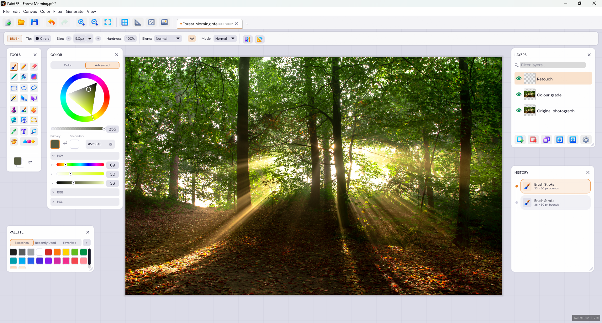
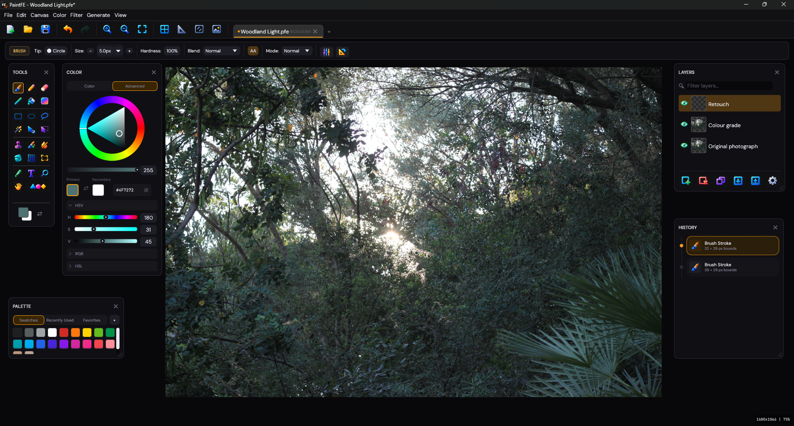
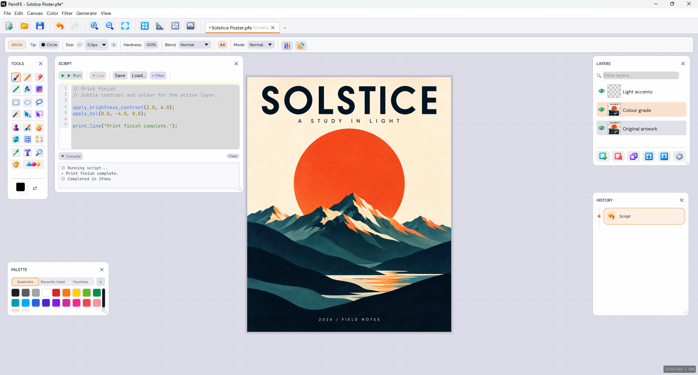

# PaintFE

Free, open-source raster image editor built in Rust. Single portable binary, no installer required.

**[Download the latest release](https://github.com/kylejckson/PaintFE/releases/latest)** &nbsp;·&nbsp;
**[Website](https://paintfe.com)** &nbsp;·&nbsp;
**[Scripting Docs](https://paintfe.com/scripting.html)** &nbsp;·&nbsp;
**[Troubleshooting](https://paintfe.com/troubleshooting.html)**


[](https://github.com/kylejckson/PaintFE/releases/latest)
[](https://scorecard.dev/viewer/?uri=github.com/kylejckson/PaintFE)
[](https://www.bestpractices.dev/projects/12019)

24 tools · 25 blend modes · GPU compositing · Rhai scripting · CLI batch processing · local background removal · GIF/APNG/WebP animation · RAW camera support · 15 UI languages



## What's new in 1.4.0

- **A fresh look:** Luminous icons, a new app logo, and redesigned Color, Palette, and History panels. Classic icons remain available, and custom packs load from folders or ZIPs.
- **A workspace that fits you:** panel snapping, faint alignment guides, saved layouts, configurable motion, and refined numeric controls.
- **Better painting and pixel art:** corrected brush hardness, reliable soft-stroke overlap, a clearer pixel grid, raw Pencil input, and a Pixel Art preset.
- **A faster feel:** improved painting, hover, click, and menu responsiveness, plus stepped zoom and improved Fit to Window.
- **More editing control:** paste cropping and before/after effect comparison, alongside fixes for stale canvases, layer thumbnails, and icon-pack colors.

See the [changelog](CHANGELOG.md) for the full release history.

## Painting and Pixel Art

- **Paint:** Brush, Pencil, Eraser, Line, Fill, and Gradient. Brush tips, spacing, hardness, flow, opacity, and stroke stabilization, with Normal, Uniform, Build Up, Dodge, Burn, and Sponge modes.
- **Select:** Rectangle, Ellipse, Lasso, and Magic Wand, with Add/Subtract/Intersect modes. Move pixels or selections, select by color range, or select layer content bounds.
- **Retouch and warp:** Smudge, Clone Stamp, Content-Aware Brush, Color Remover, Liquify, Mesh Warp, and Perspective Crop.
- **Create and navigate:** system-font Text, shape primitives, Color Picker, Pan, and Zoom.
- **Work pixel by pixel:** a Pixel Art preset, configurable pixel-grid appearance, stepped zoom, Fit to Window, and a rebindable 100% zoom action.
- **Place pasted images:** crop handles, Commit & Crop, optional selection after paste, and edge and center alignment snapping.

## Workspace

Light and dark themes, Luminous or Classic icons, and custom icon packs let you choose the look. Floating panels support remembered positions, optional edge and alignment snapping, named layouts, and an easy reset.

The Color panel offers compact Color and Advanced modes with collapsible HSV, RGB, and HSL controls. Palette swatches reflow as you resize the panel, with recent colors and favorites close at hand. The History timeline shows tool icons and compact action details.

Preferences include theme colors, corner radii, spacing, motion, reduced-motion support, and numeric adjustment behavior. Motion can be subtle, expressive, or turned off.

## Layers, Filters, and Adjustments

Layer folders, visibility, opacity, masks, and 25 blend modes support layered editing, with undo and redo throughout the workflow.

**Adjustments:** Auto Levels, Brightness/Contrast, Curves, Exposure, Highlights/Shadows, HSL, Levels, Color Temperature, Color Balance, Vibrance, Gradient Map, Desaturate, Invert, and Sepia.

**Filters and effects:** Gaussian, Box, Motion, and Bokeh blur; Sharpen, Reduce Noise, Median, Pixelate, Vignette, Glow, Halftone, Oil Painting, Crystallize, Ink, Distort, Noise, Glitch, Drop Shadow, Outline, and Contour.

Recover Transparency helps remove flattened backgrounds, while Make Seamless Texture prepares tileable artwork. Pixel Art Retarget offers palette-aware and structure-preserving image resizing. Toggle live effect previews to compare the original and edited image.

## Scripting and Batch Processing

The embedded [Rhai](https://rhai.rs/) engine provides a sandboxed pixel API and live canvas preview. Run scripts in **View > Script Editor** or process files through the CLI.

```rhai
apply_desaturate();
apply_brightness_contrast(10.0, 40.0);
apply_vignette(0.5, 0.3);

map_channels(|r, g, b, a| {
    [clamp(r + 15, 0, 255), g, clamp(b - 8, 0, 255), a]
});
```

The API includes pixel access, selections, effects, canvas transforms, color helpers, progress reporting, and math functions. Pixel edits and effects can respect the active selection. See the [scripting reference](https://paintfe.com/scripting.html) for individual API behavior.

```sh
PaintFE -i "shots/*.tif" --script process.rhai --format png --output-dir ./out
PaintFE -i photo.png --format jpeg --quality 90 -o out.jpg
```

<details>
<summary>CLI options</summary>

| Flag | Description |
|------|-------------|
| `-i` / `--input` | Input files or glob patterns (required for CLI mode) |
| `-s` / `--script` | Path to a `.rhai` script |
| `-o` / `--output` | Output file path for a single input |
| `--output-dir` | Output directory for batch jobs |
| `-f` / `--format` | `png`, `jpeg`, `webp`, `tiff`, `bmp`, `tga`, `ico`, `gif` (static), or `pfe` |
| `-q` / `--quality` | JPEG/lossy WebP quality (1-100, default 90) |
| `--webp-lossy` | Use lossy WebP; WebP output defaults to lossless |
| `--tiff-compression` | `none`, `lzw`, or `deflate` |
| `--flatten` | Raster exports are flattened; PFE output preserves layers |
| `-v` / `--verbose` | Script output and per-file timing information |

Exit `0` means all files succeeded. Exit `1` means at least one failed; remaining files still process. CLI mode is selected with `-i` or `--input` and does not open the editor. On Linux, use `./PaintFE` if the executable is not on your PATH.

</details>

## More Screenshots

<details>
<summary>Dark-mode photo editing and poster scripting</summary>

Photo editing in dark mode, with layers and retouching history.



Poster design with the built-in Rhai editor and a completed image-processing script.



</details>

Photo sources and artwork details are listed in [screenshot credits](screenshot/CREDITS.txt).

## File Formats

| | Formats |
|---|---|
| **Read** | PNG, JPEG, WebP, BMP, TIFF, TGA, GIF, APNG, PFE, PDN, and supported camera RAW files |
| **Write** | PNG, JPEG, WebP, BMP, TIFF, TGA, ICO, GIF, APNG, and PFE |
| **Animation** | GIF, APNG, and WebP import and export |

PFE is PaintFE's layered project format. Animated export uses each visible layer as a frame, with frame rate, loop count, and format-specific compression options in the export dialog.

RAW decoding uses `rawloader` and `imagepipe`. Recognized extensions include CR2, CR3, NEF, ARW, DNG, ORF, RW2, SRW, PEF, and RAF; decoding depends on the camera and file variant.

Paint.NET PDN import requires the compatibility host. Projects are imported as raster layers with names, visibility, opacity, and supported blend modes. Save opens Save As so the imported project can be stored as PFE or exported without overwriting the source PDN.

## Optional Integrations

### Local Background Removal

Background removal runs locally through ONNX Runtime. Images are processed on your machine without cloud uploads or API calls.

Supported model families are **BiRefNet**, **U2-Net**, and **IS-Net (DIS)**. Open **Edit > Preferences > AI** and select an ONNX Runtime library and model file. Versioned Linux runtime libraries are also accepted. Model links are available in Preferences; runtime downloads are available from [ONNX Runtime releases](https://github.com/microsoft/onnxruntime/releases).

### Paint.NET Legacy Plugins (Experimental)

PaintFE supports a limited profile of classic Paint.NET 3.5 CPU effect plugins through an optional out-of-process .NET host. Open **Edit > Preferences > Plugins**, import a DLL, and explicitly trust it. Supported plugins use `PropertyBasedEffect` with standard numeric, boolean, or list properties.

Modern Paint.NET GPU effects, file-type plugins, and custom WinForms dialogs are unsupported. Plugin DLLs are executable programs: the host isolates crashes but is not a security sandbox. Only import plugins from authors you trust. PaintFE does not contain or redistribute Paint.NET binaries.

## Responsiveness

PaintFE uses GPU compositing, incremental texture updates, shared image tiles, and lightweight undo records to reduce unnecessary work. CPU filters and image operations use Rayon where appropriate, while larger brush dabs can process independent chunks in parallel.

Interaction improvements include reduced UI layout work, cached icon rendering, fewer settings writes, and configurable low-latency presentation. Performance depends on image size, layer count, brush settings, effects, and hardware.

## Building from Source

The repository's [rust-toolchain.toml](rust-toolchain.toml) pins the Rust toolchain. Install Rust through rustup and the platform requirements below.

```sh
git clone https://github.com/kylejckson/PaintFE.git
cd PaintFE

# Debug build
cargo build

# Optimized build
cargo build --release

# Run the editor
cargo run --release
```

The release executable is `target/release/PaintFE` on Linux and macOS, or `target/release/PaintFE.exe` on Windows.

**Windows:** use the MSVC Rust toolchain with Visual Studio C++ Build Tools and the Windows SDK. The build script embeds the application icon using `winresource`.

**Linux:** source builds require development libraries for GTK, X11/Wayland, graphics, and OpenSSL. The Ubuntu packages used by release CI are listed below. These are build requirements; packaged downloads have different runtime requirements.

<details>
<summary>Ubuntu build dependencies</summary>

```sh
sudo apt-get install -y \
  libgtk-3-dev libxcb-render0-dev libxcb-shape0-dev libxcb-xfixes0-dev \
  libxkbcommon-dev libvulkan-dev libwayland-dev libegl1-mesa-dev \
  libssl-dev pkg-config
```

</details>

**macOS:** install the Xcode command-line tools and the matching Rust toolchain for your architecture.

The optional Paint.NET compatibility host is built separately with the .NET 8 SDK. See [its README](paintdotnet-host/README.md) for instructions.

<details>
<summary>Main dependencies</summary>

| Crate | Purpose |
|-------|---------|
| `eframe` / `egui` | Immediate-mode GUI framework |
| `wgpu` | GPU rendering and compute |
| `rayon` | CPU parallelism |
| `rhai` | Embedded scripting engine |
| `image` | Image codecs |
| `rawloader` / `imagepipe` | Camera RAW decoding and processing |
| `arboard` | System clipboard |
| `libloading` | Dynamic ONNX Runtime loading |
| `clap` | CLI argument parsing |
| `bytemuck` | GPU buffer casting |
| `serde` / `bincode` | Project serialization |

See [Cargo.toml](Cargo.toml) for versions and the complete dependency list.

</details>

## Contributing and Translations

Bug reports, feature requests, translations, and pull requests are welcome. See [CONTRIBUTING.md](CONTRIBUTING.md) for development setup and contribution guidelines.

15 locales ship built in and can be switched through **View > Language**: English, German, French, Spanish, Portuguese, Italian, Russian, Polish, Dutch, Turkish, Japanese, Simplified Chinese, Traditional Chinese, Belarusian, and Fandom (FE). New controls may fall back to English where translations are incomplete.

To add a translation, copy `locales/en.txt`, translate the values without changing keys, and name the file with its BCP-47 code, such as `ko.txt`.

## FAQ

**Is it really free?**

Yes. PaintFE is MIT licensed, with no subscription, account requirement, telemetry, or feature gates. Use it commercially, fork it, or redistribute it.

**Does it work on macOS?**

macOS builds are available on the [releases page](https://github.com/kylejckson/PaintFE/releases/latest). They are unsigned and not notarized, so Gatekeeper may require you to approve the first launch. See [troubleshooting](https://paintfe.com/troubleshooting.html) for help.

**Why is it called PaintFE?**

FE is the periodic table symbol for iron. It's built in Rust. That's the joke. Call it whatever acronym you want.

## License

[MIT](LICENSE.md). Bundled font licenses and screenshot credits accompany their respective assets.

*Built in Rust. Free forever. Made by Kyle and contributors.*
